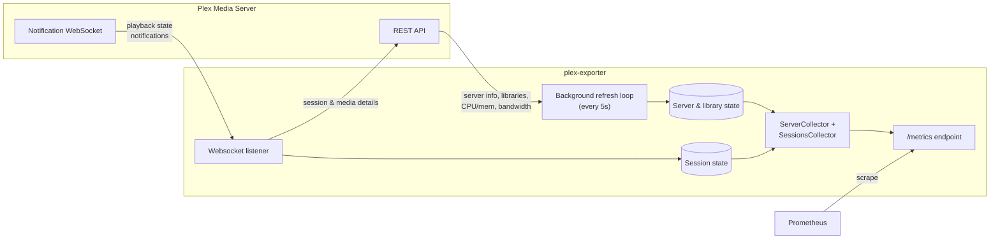

# media-exporter

A Prometheus exporter for Plex and Jellyfin, written in Rust.

## Metrics

| Metric | Type | Description |
| --- | --- | --- |
| `plex_up` | gauge | `1` if the most recent refresh of server-level state from Plex succeeded, `0` otherwise. |
| `plex_server_info` | gauge | Always `1`. Labeled with server type/name/id, version, platform, platform version. |
| `plex_host_cpu_util` | gauge | Host CPU utilization (requires Plex Pass). |
| `plex_host_mem_util` | gauge | Host memory utilization (requires Plex Pass). |
| `plex_transmit_bytes_total` | counter | Bytes transmitted per Plex's own bandwidth statistics (requires Plex Pass). |
| `plex_library_duration_total` | gauge | Total duration of a library, per library. |
| `plex_library_storage_total` | gauge | Total storage size of a library, per library. |
| `plex_library_items_total` | gauge | Total number of items in a library, per library. |
| `plex_plays_total` | counter | Total play count, per playback session. |
| `plex_play_seconds_total` | counter | Total play time, per playback session. |
| `plex_estimated_transmit_bytes_total` | counter | Estimated bytes transmitted, based on active session bitrates. |
| `plex_active_sessions` | gauge | `1` per currently active session, labeled like `plex_plays_total` plus `state` (`playing`/`paused`/`buffering`). |
| `plex_transcode_speed` | gauge | Current transcode speed for an active session, where `1.0` is real-time. |
| `plex_transcode_throttled` | gauge | Whether an active session's transcode is currently throttled. |
| `plex_websocket_connected` | gauge | `1` while connected to Plex's notification websocket, `0` otherwise. |
| `plex_websocket_reconnects_total` | counter | Incremented each time the notification websocket has to be (re)established. |
| `plex_scrape_errors_total` | counter | Failed requests to the Plex API, labeled by `endpoint`. |
| `plex_last_refresh_timestamp_seconds` | gauge | Unix timestamp of the last successful refresh; `0` until one succeeds. |

## Configuration

Configured via environment variables:

- `PLEX_SERVER`: full URL of your Plex server, e.g. `http://192.168.0.10:32400`.
- `PLEX_TOKEN`: a [Plex token](https://support.plex.tv/articles/204059436-finding-an-authentication-token-x-plex-token/) belonging to the server administrator.
- `BIND_ADDRESS`: address the metrics server listens on. Defaults to `0.0.0.0`.
- `PORT`: port the metrics server listens on. Defaults to `9000`.
- `RUST_LOG`: log level filter (e.g. `info`, `debug`). Defaults to no output.

## Running

```bash
PLEX_SERVER=http://192.168.0.10:32400 PLEX_TOKEN=... cargo run --release
```

Metrics are served on `:9000/metrics`.

## How it works

On startup the exporter does an initial fetch of server/library state, then
runs two things concurrently for as long as the process is alive: a polling
loop against Plex's REST API, and a persistent connection to Plex's
notification websocket for playback events. Both feed in-memory state that
is turned into Prometheus metrics on demand whenever `/metrics` is scraped.



Library and session metrics are recomputed from current state on every
scrape via a custom `prometheus::core::Collector`, so stale libraries and
finished sessions drop out of `/metrics` instead of lingering. Sessions are
also pruned from memory a minute after they stop.

Unlike the upstream Go exporter, the websocket connection to Plex's
notification stream is retried with a fixed backoff on error instead of
exiting the process.

## Health and alerting

Without these, a Plex server that stops answering is indistinguishable from an
idle one: every other metric simply freezes at its last value and nothing
alerts.

- `plex_up` is `0` whenever the most recent refresh of server-level state
  failed, and `1` once one succeeds.
- `plex_scrape_errors_total` breaks failures down by `endpoint` — one of
  `providers`, `library_items`, `server_info`, `resources`, `bandwidth`,
  `sessions`, `metadata`, `websocket` — so a revoked token looks different
  from a single unhappy library.
- `plex_last_refresh_timestamp_seconds` is the age of the data behind every
  other metric.

```yaml
- alert: PlexUnreachable
  expr: plex_up == 0
  for: 5m

- alert: PlexMetricsStale
  expr: time() - plex_last_refresh_timestamp_seconds > 300
  for: 5m
```

A Plex server that is unreachable at startup no longer stops the exporter from
starting. It comes up serving `plex_up 0` and keeps retrying, so an outage
shows up in Grafana rather than as a crash-looping container.

Two things deliberately do **not** count against `plex_up`. The Plex Pass-only
endpoints (`resources`, `bandwidth`) answer `404` when the feature isn't
licensed, which is an expected outcome and isn't recorded as an error at all. A
library whose item count can't be fetched does increment
`plex_scrape_errors_total{endpoint="library_items"}`, but leaves `plex_up` at
`1`, since the server itself is plainly still answering.
