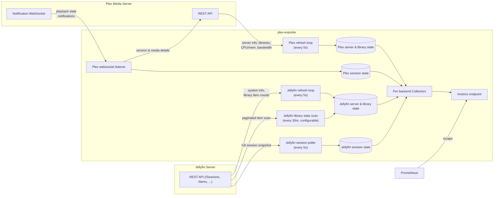

# plex-exporter

A Prometheus exporter for Plex and Jellyfin, written in Rust. Each backend is
independently optional and runs concurrently in the same process; enable
either or both by setting their respective environment variables.

## Metrics

### Plex (`plex_` prefix)

| Metric | Type | Description |
| --- | --- | --- |
| `plex_up` | gauge | `1` if the most recent refresh of server-level state from Plex succeeded, `0` otherwise. |
| `plex_server_info` | gauge | Always `1`. Labeled with server type/name/id, version, platform, platform version. |
| `plex_host_cpu_util` | gauge | Host CPU utilization (requires Plex Pass). |
| `plex_host_mem_util` | gauge | Host memory utilization (requires Plex Pass). |
| `plex_transmit_bytes_total` | counter | Bytes transmitted per Plex's own bandwidth statistics (requires Plex Pass). |
| `plex_library_duration_total` | gauge | Total duration of a library, per library. |
| `plex_library_storage_total` | gauge | Total storage size of a library, per library. |
| `plex_library_items_total` | gauge | Total number of items in a library, per library. |
| `plex_plays_total` | counter | Total play count, per playback session. |
| `plex_play_seconds_total` | counter | Total play time, per playback session. |
| `plex_estimated_transmit_bytes_total` | counter | Estimated bytes transmitted, based on active session bitrates. |
| `plex_active_sessions` | gauge | `1` per currently active session, labeled like `plex_plays_total` plus `state` (`playing`/`paused`/`buffering`). |
| `plex_transcode_speed` | gauge | Current transcode speed for an active session, where `1.0` is real-time. |
| `plex_transcode_throttled` | gauge | Whether an active session's transcode is currently throttled. |
| `plex_websocket_connected` | gauge | `1` while connected to Plex's notification websocket, `0` otherwise. |
| `plex_websocket_reconnects_total` | counter | Incremented each time the notification websocket has to be (re)established. |
| `plex_scrape_errors_total` | counter | Failed requests to the Plex API, labeled by `endpoint`. |
| `plex_last_refresh_timestamp_seconds` | gauge | Unix timestamp of the last successful refresh; `0` until one succeeds. |

### Jellyfin (`jellyfin_` prefix)

| Metric | Type | Description |
| --- | --- | --- |
| `jellyfin_up` | gauge | `1` if the most recent refresh of server-level state from Jellyfin succeeded, `0` otherwise. |
| `jellyfin_server_info` | gauge | Always `1`. Labeled with server type/name/id, version, platform, platform version. |
| `jellyfin_library_duration_total` | gauge | Total duration of a library in ms, per library. Computed on a separate, much slower interval than the rest of the exporter's state — see [Library stats cost](#library-stats-cost). |
| `jellyfin_library_items_total` | gauge | Total number of items in a library, per library. |
| `jellyfin_plays_total` | counter | Total play count, per playback session/item. |
| `jellyfin_play_seconds_total` | counter | Total play time, per playback session/item. |
| `jellyfin_estimated_transmit_bytes_total` | counter | Estimated bytes transmitted, based on active session bitrates. |
| `jellyfin_active_sessions` | gauge | `1` per currently active session, labeled like `jellyfin_plays_total` plus `state` (`playing`/`paused`; Jellyfin has no "buffering" signal). |
| `jellyfin_scrape_errors_total` | counter | Failed requests to the Jellyfin API, labeled by `endpoint`. |
| `jellyfin_last_refresh_timestamp_seconds` | gauge | Unix timestamp of the last successful refresh; `0` until one succeeds. |

Jellyfin's API has no equivalent of `plex_host_cpu_util`/`plex_host_mem_util`
(no host resource stats endpoint), `plex_transmit_bytes_total` (no
bandwidth-history endpoint - `jellyfin_estimated_transmit_bytes_total` is
still fully supported, since it's computed client-side from session bitrate
rather than sourced from the server), `plex_library_storage_total` (would
require scanning every item's `MediaSources`, too expensive - see below), or
`plex_transcode_speed`/`plex_transcode_throttled` (`TranscodingInfo` has no
speed multiplier or throttled flag, only codec/bitrate/completion state).
Rather than approximate these, they're simply not emitted for `jellyfin_`.

#### Library stats cost

Plex returns a library's total duration and storage size as part of a single,
cheap aggregate call. Jellyfin has no equivalent aggregate: getting a
library's total duration means paginating through every item in it
(`Fields=RunTimeTicks`, no images - still real cost on a library with tens of
thousands of items). `jellyfin_library_duration_total` is therefore computed
on its own, much longer interval (`JELLYFIN_LIBRARY_STATS_INTERVAL_SECS`,
default 30 minutes) rather than the same fast interval as the rest of
Jellyfin's state, and stays at its last known value between scans.
`jellyfin_library_storage_total` isn't implemented at all: getting file sizes
needs the much heavier `MediaSources` field per item, on top of the
per-item cost above.

## Configuration

Configured via environment variables. At least one of the Plex or Jellyfin
server/token pairs must be set; both may be set to run the exporter against
both backends at once.

- `BIND_ADDRESS`: address the metrics server listens on. Defaults to `0.0.0.0`.
- `PORT`: port the metrics server listens on. Defaults to `9000`.
- `RUST_LOG`: log level filter (e.g. `info`, `debug`). Defaults to no output.

Plex:

- `PLEX_SERVER`: full URL of your Plex server, e.g. `http://192.168.0.10:32400`.
- `PLEX_TOKEN`: a [Plex token](https://support.plex.tv/articles/204059436-finding-an-authentication-token-x-plex-token/) belonging to the server administrator.

Jellyfin:

- `JELLYFIN_SERVER`: full URL of your Jellyfin server, e.g. `http://192.168.0.10:8096`.
- `JELLYFIN_TOKEN`: a Jellyfin API key (Dashboard → API Keys).
- `JELLYFIN_LIBRARY_STATS_INTERVAL_SECS`: how often to recompute `jellyfin_library_duration_total` by scanning every item in every library. Defaults to `1800` (30 minutes) - lower this only if your libraries are small enough that the scan cost doesn't matter.

## Running

```bash
PLEX_SERVER=http://192.168.0.10:32400 PLEX_TOKEN=... \
JELLYFIN_SERVER=http://192.168.0.10:8096 JELLYFIN_TOKEN=... \
cargo run --release
```

Either backend can be omitted; the exporter only requires at least one to be
configured. Metrics are served on `:9000/metrics`.

## How it works

On startup the exporter does an initial fetch of server/library state for
each configured backend, then runs its state-tracking loops concurrently for
as long as the process is alive. Both backends feed independent in-memory
state that's turned into Prometheus metrics on demand whenever `/metrics` is
scraped, sharing one registry and one HTTP server.



Library and session metrics are recomputed from current state on every
scrape via a custom `prometheus::core::Collector`, so stale libraries and
finished sessions drop out of `/metrics` instead of lingering. Sessions are
also pruned from memory a minute after they stop.

Unlike the upstream Go exporter, the websocket connection to Plex's
notification stream is retried with a fixed backoff on error instead of
exiting the process.

Jellyfin session tracking works differently from Plex's: rather than a
websocket listener, it's a plain poll of `GET /Sessions` every 5 seconds.
Jellyfin's websocket doesn't reliably push periodic session updates even
after requesting them, so polling the REST endpoint directly is the option
that actually works; it also has the advantage that `/Sessions` already
embeds full now-playing item, play state, and transcoding detail, so unlike
Plex's listener, no second per-session metadata fetch is needed. Jellyfin
also reuses one session id across successive items played back to back (e.g.
autoplaying the next episode), unlike Plex's per-playback session key, so the
exporter tracks each item played within a session as its own "segment" with
its own play count/seconds, closing one out and opening the next whenever the
now-playing item changes.

## Health and alerting

Without these, a server that stops answering is indistinguishable from an
idle one: every other metric simply freezes at its last value and nothing
alerts. This applies independently to each configured backend.

- `plex_up`/`jellyfin_up` is `0` whenever the most recent refresh of
  server-level state failed, and `1` once one succeeds.
- `plex_scrape_errors_total`/`jellyfin_scrape_errors_total` breaks failures
  down by `endpoint` so a revoked token looks different from a single unhappy
  library. Plex's endpoints: `providers`, `library_items`, `server_info`,
  `resources`, `bandwidth`, `sessions`, `metadata`, `websocket`. Jellyfin's:
  `system_info`, `libraries`, `library_items`, `library_duration_scan`,
  `sessions`.
- `plex_last_refresh_timestamp_seconds`/`jellyfin_last_refresh_timestamp_seconds`
  is the age of the data behind every other metric for that backend.

```yaml
- alert: MediaServerUnreachable
  expr: plex_up == 0 or jellyfin_up == 0

- alert: MediaServerMetricsStale
  expr: (time() - plex_last_refresh_timestamp_seconds > 300) or (time() - jellyfin_last_refresh_timestamp_seconds > 300)
  for: 5m
```

A server that is unreachable at startup no longer stops the exporter from
starting. It comes up serving `plex_up 0`/`jellyfin_up 0` and keeps retrying,
so an outage shows up in Grafana rather than as a crash-looping container.

Two things deliberately do **not** count against `plex_up`. The Plex Pass-only
endpoints (`resources`, `bandwidth`) answer `404` when the feature isn't
licensed, which is an expected outcome and isn't recorded as an error at all. A
library whose item count can't be fetched does increment
`plex_scrape_errors_total{endpoint="library_items"}`, but leaves `plex_up` at
`1`, since the server itself is plainly still answering. The same holds for
`jellyfin_up`: a library whose item count or duration scan fails increments
`jellyfin_scrape_errors_total` but doesn't clear `jellyfin_up`.
